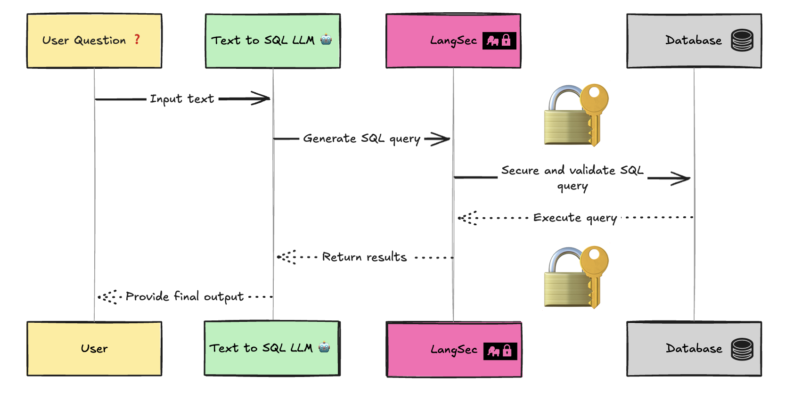

# LangSec: A Security Framework for Language Models
A security framework for validating and securing LLM-generated SQL queries. LangSec helps prevent SQL injection, unauthorized access, and other security vulnerabilities when working with language models that generate SQL.


Demonstration of making a malicious query using [vanna](https://github.com/vanna-ai/vanna).
LangSec helps prevent such attacks by validating generated queries against a security schema.



## Installation

```bash
pip install langsec
```

## Quick Start

```python
from langsec import SQLSecurityGuard
from langsec.models.schema import SecuritySchema, TableSchema, ColumnRule
from langsec.models.enums import ColumnAccess

# Define your security schema
schema = SecuritySchema(
    tables={
        "users": TableSchema(
            columns={
                "id": ColumnRule(access=ColumnAccess.READ),
                "username": ColumnRule(access=ColumnAccess.READ),
                "email": ColumnRule(access=ColumnAccess.DENIED),
            }
        )
    }
)

# Create security guard
guard = SQLSecurityGuard(schema=schema)

# Validate queries
try:
    # This will pass
    guard.validate_query("SELECT id, username FROM users WHERE id = 1")
    
    # This will raise ColumnAccessError
    guard.validate_query("SELECT email FROM users")
except Exception as e:
    print(f"Query validation failed: {e}")
```

## Configuration

### Security Schema

The security schema defines what operations are allowed on your database:

```python
from langsec.models.schema import SecuritySchema, TableSchema, ColumnRule, JoinRule
from langsec.models.enums import ColumnAccess, JoinType, AggregationType

schema = SecuritySchema(
    tables={
        "users": TableSchema(
            columns={
                "id": ColumnRule(access=ColumnAccess.READ),
                "username": ColumnRule(access=ColumnAccess.READ),
                "email": ColumnRule(access=ColumnAccess.DENIED),
                "created_at": ColumnRule(access=ColumnAccess.READ),
            },
            max_rows=1000,
            require_where_clause=True,
            allowed_joins={
                "orders": JoinRule(allowed_types={JoinType.INNER, JoinType.LEFT})
            },
        ),
        "orders": TableSchema(
            columns={
                "id": ColumnRule(access=ColumnAccess.READ),
                "amount": ColumnRule(
                    access=ColumnAccess.READ,
                    allowed_aggregations={AggregationType.SUM, AggregationType.AVG},
                ),
            }
        ),
    },
    max_joins=2,
    allow_subqueries=True,
    max_query_length=500,
    forbidden_keywords={"DROP", "DELETE", "TRUNCATE"},
)
```

### Column Access Control

Control access to individual columns:

```python
# Column access levels
READ = ColumnAccess.READ      # Column can be read
WRITE = ColumnAccess.WRITE    # Column can be written (not implemented yet)
DENIED = ColumnAccess.DENIED  # Column access is denied
```

Note: if a column is not defined in the schema, it is assumed to be `DENIED`.

### Join Control

Define allowed join types between tables:

```python
allowed_joins={
    "orders": JoinRule(allowed_types={
        JoinType.INNER, 
        JoinType.LEFT
    })
}
```

### Aggregation Control

Control which aggregation functions can be used on specific columns:

```python
"amount": ColumnRule(
    access=ColumnAccess.READ,
    allowed_aggregations={
        AggregationType.SUM,
        AggregationType.AVG,
        AggregationType.COUNT
    }
)
```

## Error Handling

LangSec provides specific exceptions for different types of violations:

```python
from langsec.exceptions.errors import (
    ColumnAccessError,
    TableAccessError,
    JoinViolationError,
    QueryComplexityError,
)

try:
    guard.validate_query(query)
except ColumnAccessError as e:
    print(f"Column access violation: {e}")
except TableAccessError as e:
    print(f"Table access violation: {e}")
except JoinViolationError as e:
    print(f"Join violation: {e}")
except QueryComplexityError as e:
    print(f"Query too complex: {e}")
```

## Advanced Usage

### Working with Table Aliases

LangSec handles table aliases transparently:

```python
# These queries are equivalent
guard.validate_query("SELECT users.username FROM users")
guard.validate_query("SELECT u.username FROM users u")
```

### Subqueries

Control subquery usage:

```python
schema = SecuritySchema(
    tables={...},
    allow_subqueries=True  # Enable/disable subqueries
)
```

### Query Length Limits

Prevent overly complex queries:

```python
schema = SecuritySchema(
    tables={...},
    max_query_length=500  # Maximum query length in characters
)
```

## Integration with LLMs

Example using LangSec with OpenAI:

```python
from openai import OpenAI
from langsec import SQLSecurityGuard

client = OpenAI()
guard = SQLSecurityGuard(schema=your_schema)

def get_safe_sql(prompt: str) -> str:
    response = client.chat.completions.create(
        model="gpt-3.5-turbo",
        messages=[
            {"role": "system", "content": "You are a SQL query generator."},
            {"role": "user", "content": prompt}
        ]
    )
    
    query = response.choices[0].message.content
    
    # Validate query before execution
    try:
        guard.validate_query(query)
        return query
    except Exception as e:
        raise ValueError(f"Generated query is not safe: {e}")
```

## Contributing

Contributions are welcome! Please feel free to submit a Pull Request.

## License

APACHE 2.0 © 2024 LangSec

## Support

For issues and feature requests, please create an issue on GitHub or contact dev@lang-sec.com.